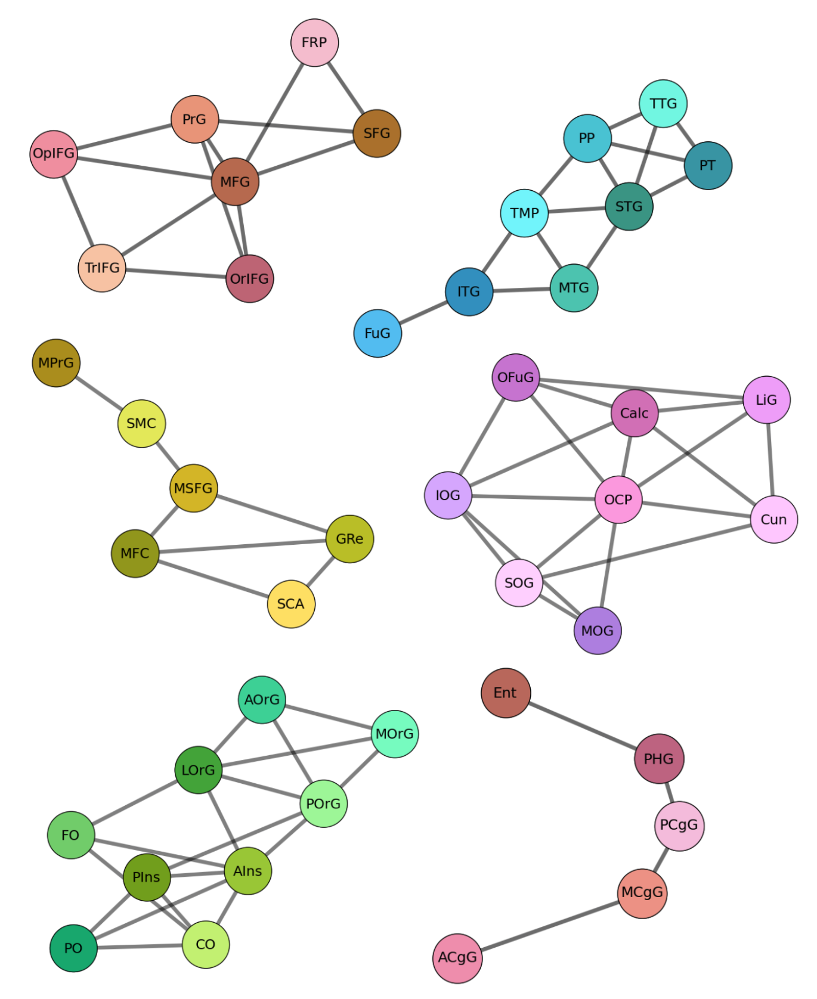
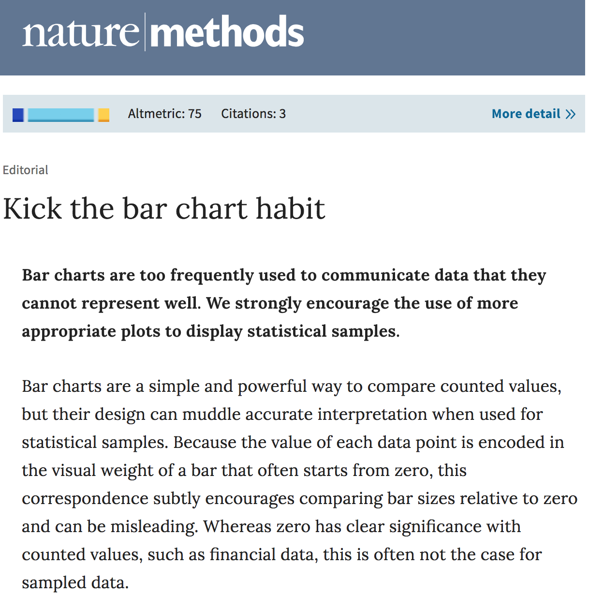

class: center middle

# Scientific Information Visualization
### satra@mit.edu  |  CC-BY
---

.footnote[ .red[*] [https://www.edwardtufte.com/tufte/minard](https://www.edwardtufte.com/tufte/minard)]
---
class: center middle

---
class: center middle

---
## Abstracting information

.pull-right[

]
.footnote[ [*] [Cajal's drawings](https://cvc.cervantes.es/ciencia/cajal/cajal_recuerdos/recuerdos/laminas.htm)]
---
## A Process description

---
.footnote[[*] [Hippocampal Neuron Type Potential Connectome](http://www.eneuro.org/content/3/6/ENEURO.0205-16.2016)]

.pull-left[

]
.pull-right[

]
---
### EM microscopy and reconstruction
[Link](https://neuroglancer-demo.appspot.com/#!%7B%22layers%22:%7B%22original-image%22:%7B%22source%22:%22precomputed://gs://neuroglancer-public-data/kasthuri2011/image%22%2C%22type%22:%22image%22%2C%22visible%22:false%7D%2C%22corrected-image%22:%7B%22source%22:%22precomputed://gs://neuroglancer-public-data/kasthuri2011/image_color_corrected%22%2C%22type%22:%22image%22%7D%2C%22ground_truth%22:%7B%22source%22:%22precomputed://gs://neuroglancer-public-data/kasthuri2011/ground_truth%22%2C%22type%22:%22segmentation%22%2C%22selectedAlpha%22:0.63%2C%22notSelectedAlpha%22:0.14%2C%22segments%22:%5B%2213%22%2C%2215%22%2C%222282%22%2C%223189%22%2C%223207%22%2C%223208%22%2C%223224%22%2C%223228%22%2C%223710%22%2C%223758%22%2C%224027%22%2C%22444%22%2C%224651%22%2C%224901%22%2C%224965%22%5D%7D%7D%2C%22navigation%22:%7B%22pose%22:%7B%22position%22:%7B%22voxelSize%22:%5B6%2C6%2C30%5D%2C%22voxelCoordinates%22:%5B5523.99072265625%2C8538.9384765625%2C1198.0423583984375%5D%7D%7D%2C%22zoomFactor%22:22.573112129999547%7D%2C%22perspectiveOrientation%22:%5B-0.0040475670248270035%2C-0.9566215872764587%2C-0.22688281536102295%2C-0.18271005153656006%5D%2C%22perspectiveZoom%22:340.35867907175077%7D)
---
### High dimensional traversal
<iframe src="http://openneu.ro/metasearch" width="100%" height="90%"/>
---
### 2D and 3D views
<iframe src="https://neurovault.org/collections/3457/" width="100%" height="90%"/>
---
### Automatic Fiber Quantification (AFQ) Browser

<iframe src="https://yeatmanlab.github.io/AFQBrowser-demo/" width="100%" height="90%"/>
---
class: middle

## Taxonomy 1: Data state reference model .red[#]
## Taxonomy 2: Unified taxonomic framework .red[*]
.footnote[.red[#] Chi (2000) [A Taxonomy of Visualization Techniques using the
Data State Reference Model.](https://pdfs.semanticscholar.org/e353/cd93eefa2a959ea725308dcebb59f870b2b9.pdf)    .red[*] Pfitzner, Hobbs, Powers (2001) [A Unified Taxonomic Framework for Information Visualization](https://www.semanticscholar.org/paper/A-Unified-Taxonomic-Framework-for-Information-Visu-Pfitzner-Hobbs/353e39ec948ccb434fea79d5369384df8a532110)]
---
## Taxonomy 1

.left-column-mid[

]
--
.right-column-mid[

]
---
class: middle
## Taxonomy 1: Data Stages
---
layout: false
.left-column[
### Value
]
.right-column[
The raw data.

Examples:

- Scalars
    - Ages of people
- 1D/2D
    - Electrode recordings
    - Genotype
- 2D/3D
    - MR images of the brain
    - Lightsheet microscopy images
    - EEG, ECoG
- 3D/4+D
    - Calcium imaging
    - fMRI, dMRI
    - Multi-channel MR
- Networks/Graphs
    - Connectomes
    - Processes
]
---
.left-column[
### Value
### Analytical abstraction
]
.right-column[
Data about data, or information, a.k.a. meta-data.

Examples:
- Structured records
- Voxels
- Windows, lines, icons, points, polygons.
- Images
- Vectors (text, lines)
- Matrices, N-D arrays
- Vertices, Faces
- Graphs, Evolving graphs
]
---
.left-column[
### Value
### Analytical abstraction
### Visualization abstraction
]
.right-column[
Information that is visualizable on the screen using a visualization technique.

Examples:

- Chloropleth information
- List with item attributes
- Table
- Point set
- 2D positions
- Curves
- Triangulated surface
- Tree, Hierarchical tree
- Graph
- Network
]
---
.left-column[
### Value
### Analytical abstraction
### Visualization abstraction
### View
]
.right-column[
The end-product of the visualization mapping, where the user sees and interprets the picture presented.

Links:
- [Top left]( https://upload.wikimedia.org/wikipedia/commons/thumb/5/5e/Sleep_EEG_REM.png/800px-Sleep_EEG_REM.png)
- [Top middle](https://upload.wikimedia.org/wikipedia/en/b/b7/DiffusionMRI_glyphs.png)
- [Bottom left](https://upload.wikimedia.org/wikipedia/en/0/02/Orch_OR.PNG)
- [Bottom middle](https://upload.wikimedia.org/wikipedia/en/f/f4/Brainmaps2.jpg)

]
---
class: middle
## Taxonomy 1: Transformation operators
---
.left-column[
### Data transformation
]
.right-column[
Generates some form of analytical abstraction from the value (usually by extraction).

Examples:

- Parsers
- Algorithms
    - Marching cubes
    - Signal processing (e.g., Fast Fourier transform)
    - Dimensionality reduction techniques (e.g., PCA)
    - Graph generators/processors
    - Statistics software
- Screenshot software
- Filters
]
---
.left-column[
### Data transformation
### Visualization transformation
]
.right-column[
Takes an analytical abstraction and further reduces it into some form of visualization abstraction, which is visualizable content.

Examples:
- Each point corresponds to a participant
- Each color corresponds to brain region
- Points, lines, meshes, surfaces
- 5 points of a boxplot
- Objects with different numeric or categorical attributes
]
---
.left-column[
### Data transformation
### Visualization transformation
### Visual mapping transformation
]
.right-column[
Takes information that is in a visualizable format and presents a graphical view.

Examples:

- Plot curvature, regions, activations on brain surface
- Create a boxplot, a double sided violinplot
- Create an interactive EEG timeseries and spectral density browser
- A directed graph laid out in order of depth first search
]
---
## Taxonomy 1

.left-column-mid[

]
--
.right-column-mid[

]
---
.left-column[
## Taxonomy 2

]
.right-column[

]
---
.left-column[
### Data
]
.right-column[

.pull-left[

]
.pull-right[

]

]
---
.left-column[
### Data
### Task type
]
.right-column[
<!-- -->
- **Overview:** a view of the total collection.

- **Zoom:** a view of an individual item. This may be either at the object or attribute level.

- **Filter:** removing unwanted items from the displayed set.

- **Detail-on-demand:** getting the details of a selected group, sub-group or item.

- **Relate:** viewing the relationships between a selected group, sub-group or item.

- **History:** the actions of undoing, replaying, and refining using a store of historic information.

- **Extract:** the extraction or focusing in on sub-collection and other parameters from a given set.
]
---
.left-column[
### Data
### Task type
### Visualization
]
.right-column[

]
---
.left-column[
### Data
### Task type
### Visualization
### Contextual
]
.right-column[
<!---->

- **Life Experience:** accounts for such things as computer skills, previous experience in a field, etc.

- **Intent:** describes what the user thinks they want from using the IV.

- **Need:** describes what the user actually needs from the use of the visualization. This may evolve through the use of the IV.

- **History:** describe the IVs usage by the user - is it a one-off use (e.g. looking up the meaning of a word) or does it pertain to an ongoing activity (such as research in a field over many months or years)?

- **Device:** the type of device used to display the visualization (e.g. projector, PC, laptop, handheld computer, etc) will affect the way in which the user can or might prefer to interact.
]
---
class: middle
## Beyond taxonomy
---
.left-column[
### Cognitive load
]
.right-column[

- Life Experience
- Intent
- Need
- History
- Device

.pull-right[.footnote[.red[*] [Perriachione et al. (2016)](https://www.ncbi.nlm.nih.gov/pmc/articles/PMC5226639/figure/F1/)]
]]
---
.left-column[
### Cognitive load
]
.right-column[

.caption[Schematic representations of three hypotheses related to the health state space. Left to right: (A) Similar trajectory hypothesis, (B) State transition hypothesis, and (C) State attractor hypothesis. Only three of many possible dimensions are shown. Each arrow represents a single individual’s trajectory in this 3-D subspace. (A) Similar trajectories (blue or red) lead to similar health outcomes and can be used to compare individuals. (B) Boundaries in the state space determine transitions between healthy (blue) and unhealthy (red) conditions. (C) Attractors in the state space attract approaching (red) trajectories toward particular health conditions.]

Life Experience, Intent, Need, History, Device

.pull-right[.footnote[.red[*] [Klein and Ghosh (2016)](https://medium.com/@binarybottle/doctor-as-data-scientist-a-high-dimensional-view-of-health-4a35de24903d)]
]
]
---
.left-column[
### Cognitive load
### Aesthetics, Intent
]
.right-column[
Supports direct **visualization transform** from Pandas dataframes
<iframe src="https://seaborn.pydata.org/examples/index.html" width="100%" height="500px"/>
]
---
.left-column[
### Cognitive load
### Aesthetics, Intent
]
.right-column[

"These images represent the walls of a blood vessel in a human. The same vessel with the same data is plotted at left and right, and the only difference is the color map. This is a gross oversimplification, but the color of the vessel is related to the likelihood that atherosclerosis will occur at any given point.

Look at the image at left where the arrow is pointing. It looks like those wall values are changing pretty dramatically between the dark blue and the light blue zones. But in the image at the right below the arrow, the same interpretation is unlikely. That’s because, while the difference in values between the dark blue and the light blue is very small, the color change paints a different picture." [Link](https://figureoneblog.wordpress.com/2014/03/12/misleading-with-pictures-the-pitfalls-of-data-visualization/)
]
---
.left-column[
### Cognitive load
### Aesthetics, Intent
### Accessibility
]
.right-column[
.pull-left[
 

]
.pull-right[
- Accommodate visual concerns such as color blindness by adapting the colormap accordingly.

- Accommodate device use: paper, screen, grayscale, black and white

- Use domain information to restructure a complex problem

- [Link to poster](https://mfr.osf.io/render?url=https://osf.io/h7rpk/?action=download%26mode=render)
]
]
---
.left-column[
### Cognitive load
### Aesthetics, Intent
### Accessibility
### Domain specificity
]
.right-column[
<iframe src="https://fnndsc.github.io/ami/#viewers_upload" width="100%" height="600px"/>
]
---
.left-column[
### Cognitive load
### Aesthetics, Intent
### Accessibility
### Domain specificity
]
.right-column[
<iframe src="http://nilearn.github.io/auto_examples/index.html#visualization-of-brain-images" width="100%" height="600px"/>
]
---
.left-column[
### Cognitive load
### Aesthetics, Intent
### Accessibility
### Domain specificity
]
.right-column[
<iframe src="http://fmriprep.readthedocs.io/en/latest/_static/sample_report.html" width="100%" height="600px"/>
]
---
.left-column[
### Cognitive load
### Aesthetics, Intent
### Accessibility
### Domain specificity
### Technology
]
.right-column[

general purpose libraries:
- [matplotlib](https://matplotlib.org/)
- [seaborn](https://seaborn.pydata.org/)
- [d3](https://d3js.org/)
- [threejs](https://threejs.org/)
- [mayavi](http://docs.enthought.com/mayavi/mayavi/)

neuro options
- [nilearn](http://nilearn.github.io/auto_examples/index.html#visualization-of-brain-images)
- [pysurfer](https://pysurfer.github.io/)
- [neuroglancer](https://github.com/google/neuroglancer)

jupyter-notebook options:
- [nyroglancer](https://github.com/funkey/nyroglancer)
- [ipyvolume](http://ipyvolume.readthedocs.io/en/latest/index.html#)
- [niwidgets](https://github.com/nipy/niwidgets)
]
---
.left-column[
### Cognitive load
### Aesthetics, Intent
### Accessibility
### Domain specificity
### Technology
]
.right-column[
<iframe src="http://ipyvolume.readthedocs.io/en/latest/index.html" width="100%" height="600px"/>
]
---
.left-column[
### Cognitive load
### Aesthetics, Intent
### Accessibility
### Domain specificity
### Technology
]
.right-column[
[Link](https://mybinder.org/v2/gh/nipy/niwidgets/master?filepath=index.ipynb)
]

---
## Bar Bar plots

- https://twitter.com/hashtag/barbarplots?lang=en
- Ok when you are counting, but really bad for stats

.pull-left[

.footnote[.red[*] [Link](https://www.nature.com/articles/nmeth.2837)]
]
--
.pull-right[

]
---
<iframe src="https://debruine.github.io/plot_comparison.html" width=100% height=600/>
---
<iframe src="https://vega.github.io/vega/" width=100% height=600/>
---
## Summary

- Think of visualization as an optimization problem
- Choose the components you want to support and then choose the technology that supports it
- Consider devices and audience characteristics depending on your dissemination context
- Provide data and code and to regenerate media
---
class: middle center
# Questions?
---
## References

- https://www.youtube.com/watch?v=Q6XpgV0DZd4
- http://axismaps.github.io/thematic-cartography/articles/projections.html
- https://informationisbeautiful.net/visualizations/diversity-in-tech/
- https://www.interaction-design.org/literature/article/the-properties-of-human-memory-and-their-importance-for-information-visualization#annotations:tgMOvnnkEeeJ01-weqUBFQ
- Pfitzner, Hobbs, Powers (2001) A Unified Taxonomic Framework for Information Visualization
- Tory and Möller (2004) Rethinking Visualization: A High-Level Taxonomy
